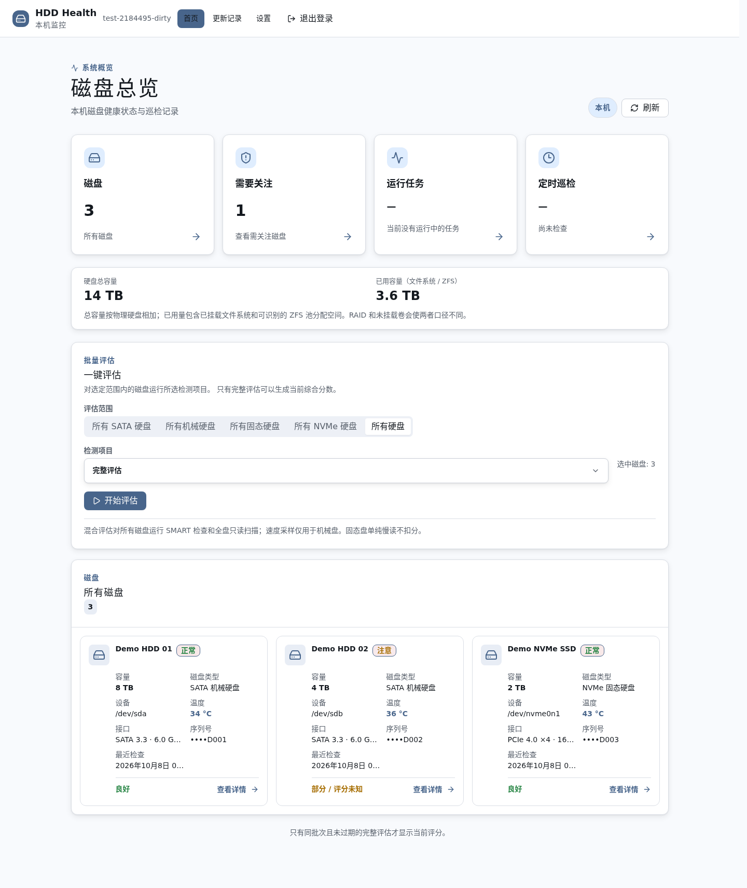
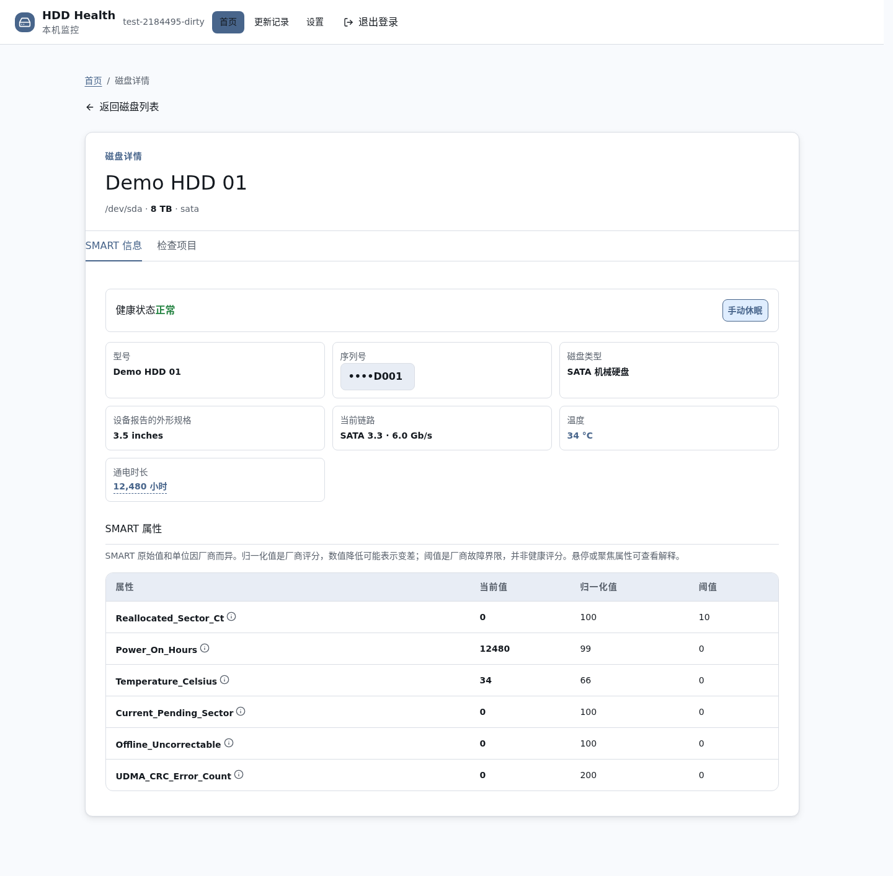
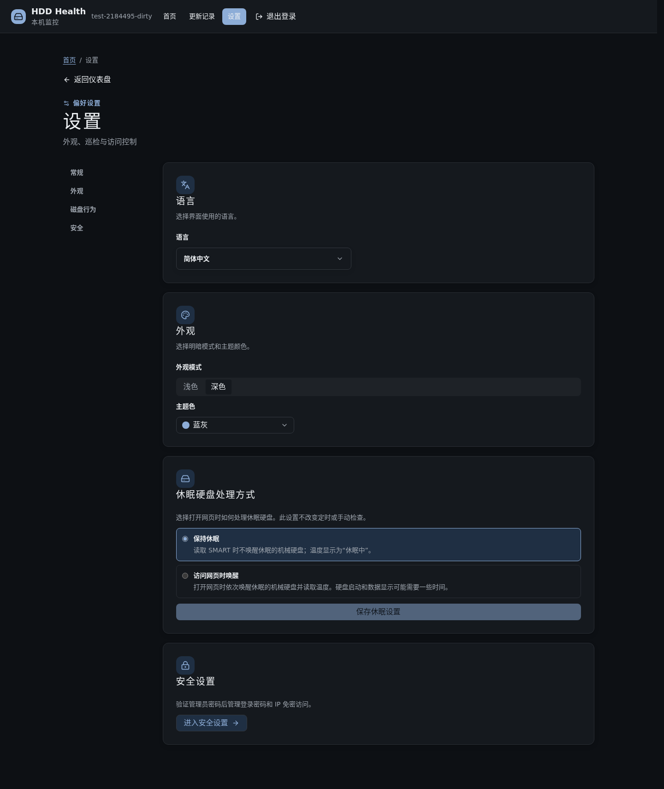
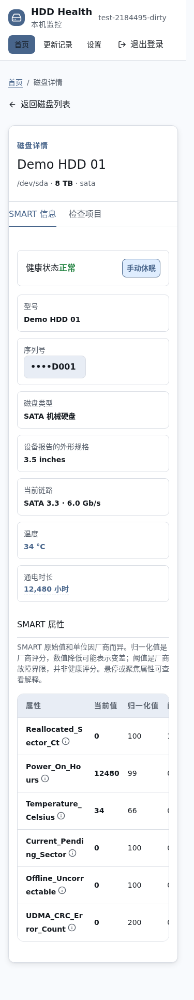

# hdd-health-check


**简体中文** | [English](doc/en/README.md) | [Español](doc/es/README.md)

用 SMART 与只读检查集中评估磁盘健康, 提供命令行和本地 Web 控制器.

[](LICENSE) [](https://github.com/CharlesGool/hdd-health-check/releases/tag/v4.1.0)

## 文档

- 项目概览: [README](README.md)

- 设计思路: [DESIGN](doc/DESIGN.md)

- 项目状态: [LOG](doc/LOG.md)
- 历史记录: [HISTORY](doc/HISTORY.md)
- 变更日志: [CHANGELOG](doc/CHANGELOG.md)

- 第三方声明: [THIRD_PARTY_NOTICES](doc/THIRD_PARTY_NOTICES.md)

## 简介

hdd-health-check 提供命令行和本地 Web 控制器, 将 SMART 信息, 自检结果, 读取异常与历史变化集中展示.

- 快速检查 SMART, 温度, 挂载状态和内核 I/O 日志; 对比历史错误计数.
- 执行短测, 长测, 速度采样, 可续扫的全盘只读扫描, badblocks 复查和维修后接口验证.
- 在网页中选择磁盘, 查看 SMART 属性解释, 跟踪后台任务, 设置定时快检和管理访问权限.
- HDD 完整评估包含快检, 短测, 长测, 速度采样和盘面扫描; SSD/NVMe 不做速度采样. 只有同一有效批次的必需检查全部完成, 才显示当前综合分数. 分数是启发式指标, 不是故障概率.

**只读指目标磁盘数据.** 程序仍会写入主机日志与状态, 可能启用 SMART 或启动磁盘内部自检; 长时间读取会增加设备负载. 检查可疑磁盘前先备份数据. 工具不执行写入模式坏块测试, 擦除或文件系统修复.

### 界面展示

以下截图来自当前源码的 Chromium 构建, 使用合成演示数据, 不代表真实磁盘测量或正式发布包. 截图仅用于展示界面; [已知问题和验证边界](doc/LOG.md#缺陷)单独记录.

#### 仪表盘

查看磁盘概况, 容量, 需要关注的记录和批量检查入口.



#### SMART 详情

查看设备属性与解释, 按需显示序列号, 在详情中切换检测结果.



#### 设置

语言, 明暗模式, 八种主题色和休眠策略集中在普通设置中; 安全设置使用独立的管理员验证.



#### 手机视图

磁盘详情和顶栏随视口重排. 这张截图使用 375 px 宽度和仿真触摸环境.



## 要求

| 组件 | 最低要求 | 推荐或补充 |
| --- | --- | --- |
| 检测器 | Debian/Ubuntu, root, Bash 4.3+, smartmontools, util-linux, coreutils | e2fsprogs 提供 badblocks; systemd 支持后台任务 |
| Web 服务 | Python 3.10+, 检测器所需的系统工具 | Debian 安装器要求 systemd, 默认局域网 TCP 8765 |
| 前端构建 | Node.js 22.12+ 或 24+, npm 10+ | npm 依赖使用锁文件; 生产 UI 不依赖外部 CDN |

真实诊断需要设备与 SMART 访问. USB/RAID 透传, SAS/SCSI 数据和厂商属性的覆盖存在限制. 本项目的 Bash 终端文本以简体中文为主, 网页提供八种语言; 核心文档提供简中, 英文和西语.

## 安装

### 快速安装

先取得并审查可信源码, 检查帮助. 此命令不会启动扫描:

```bash
bash -n hdd-health-check.sh src/checker/hdd-health-check.sh
sudo bash ./hdd-health-check.sh --help
```

### 常规安装

```bash
git clone https://github.com/CharlesGool/hdd-health-check.git
cd hdd-health-check
sudo apt-get update
sudo apt-get install --no-install-recommends smartmontools util-linux coreutils e2fsprogs
sudo bash ./hdd-health-check.sh --help
```

默认检出 `main` 当前源码. 要使用已发布版本, 从 [GitHub Release](https://github.com/CharlesGool/hdd-health-check/releases/latest)选择对应标签或预构建包; 已发布资产与当前源码可能不同. 不要把未经审查的远程脚本直接通过管道交给 root shell.

可选 Web 安装:

```bash
cd src/web
npm ci
npm run check
cd ../..
sudo bash deploy/install.sh
```

安装器仅支持 Debian, 会安装缺少的运行依赖, 部署到 `/root/apps/hdd-health-check`, 启用带密码的局域网服务. 安装本身不启动手动扫描; 已启用的定时配置会继续生效. 登录密码可由管理员在主机上用 `sudo cat /root/apps/hdd-health-check/web-password` 读取. 访问, 回滚和 API 说明见 [Web 指南](doc/WEB.md).

## 指南

```bash
sudo bash ./hdd-health-check.sh
sudo bash ./hdd-health-check.sh -d sdb -r quick,short
sudo bash ./hdd-health-check.sh -d sdb -r full --detach
sudo bash ./hdd-health-check.sh --status
sudo bash ./hdd-health-check.sh --stop
```

设备名是示例. 在执行扫描前确认目标设备和负载. `--stop` 保留盘面进度, 不会取消磁盘内部 SMART 自检.

| 选项 | 含义 |
| --- | --- |
| `-d/--disk`, `-a/--all`, `--include-ssd` | 指定逗号分隔的设备, 选择机械盘, 或纳入 SSD/NVMe |
| `-r/--run` | `quick,short,long,speed,surface,badblocks,iface,full`; 默认 `quick`, 批处理末尾生成报告 |
| `--rescan` | 重做结果与盘面扫描; 默认快检重做, 其他有效结果复用, 未完成盘面扫描续扫 |
| `--detach`, `--duration` | 交给 systemd 后台运行; 接口压力测试分钟数, 默认 15 |
| `--no-install`, `-y/--yes`, `-q/--quiet` | 禁止自动安装, 自动确认提示, 或仅写日志; `-y` 也可批准依赖安装 |
| `-l/--log` | 改变日志文件位置 |

退出码为 `0` 良好, `1` 注意或警告, `2` 危险, `3` 运行错误. 兼容参数 `-t`, `-s`, `-b` 对应现有模块; `-w/--wait` 被忽略, 不等待自检完成.

| 环境变量 | 默认或行为 | 所属组件 |
| --- | --- | --- |
| `HDD_STATE_DIR` | `/var/lib/hdd-health`, 保存设置, 结果, 历史与进度 | 检测器和 Web 服务 |
| `HDD_LOG_DIR` | `/var/log/disk-health`, 保存运行日志 | 检测器和 Web 服务 |
| `NO_COLOR` | 非空时关闭终端颜色 | 检测器 |
| `HDD_NO_BG` | 非空时关闭交互式后台移交 | 检测器 |

环境变量均可选, 路径使用可信的绝对路径; 参考 `.env.example`. 通过菜单保存的 `settings.conf` 参数见 [数据设计](doc/DESIGN.md#数据设计).

开发验证:

```bash
bash scripts/check.sh
cd src/web
npm ci
npm run check
node node_modules/playwright/cli.js install chromium
npm run test:ui
npm audit
```

构建后可从项目根运行 `node scripts/capture-doc-screenshots.mjs` 重建三种语言的介绍截图; 同样使用合成设备与隔离状态.

这些测试使用合成数据和隔离的 HTTP 服务, 不扫描真实磁盘. 文档链接检查包含在 `scripts/check.sh` 中.

## 升级

1. 停止或等待已有检查, 备份状态目录与需要保留的日志. Web 更新另行保留应用, 服务单元和密码文件.
2. 审查并更新源码; Web 用户重新构建 `src/web/`, 再运行 `deploy/install.sh`. 安装器保留已有密码与状态, 并保存旧应用和单元备份.
3. 核对 `--help`, Web 登录与构建版本, 设备清单和历史记录. 当前分数需要新一轮完整且有效的评估.

历史 `v3.0.0` 使用 `web/` 源码布局, 当前为 `src/web/` 与 `dist/web/`. 不符合当前格式的旧 v2.2 状态可能被拒绝; 不承诺 v1 CLI 或状态迁移. 回退时同时恢复旧程序及匹配的状态备份, 详见 [Web 指南](doc/WEB.md#升级与回滚).

## 卸载

快速卸载保留数据: Web 用户先执行 `sudo systemctl disable --now hdd-health-web.service`, 确认没有独立后台检查后移除已安装程序或源码目录. 删除源码不等于删除 Web 安装目录.

完全卸载: 在备份后核实并移除本项目的应用目录, systemd 单元, 状态目录和日志目录, 然后执行 `sudo systemctl daemon-reload`. 不要删除共享或被环境变量重定向的目录. 这些操作会删除检查记录; 系统软件包不会自动卸载.

## 致谢

Vue, Lucide, Markdown-It, Reka UI 与 Tailwind CSS 等组件的版本, 上游和完整许可见 [第三方声明](doc/THIRD_PARTY_NOTICES.md).

## 许可证

MIT, SPDX: `MIT`. 完整文本见 [LICENSE](LICENSE).
