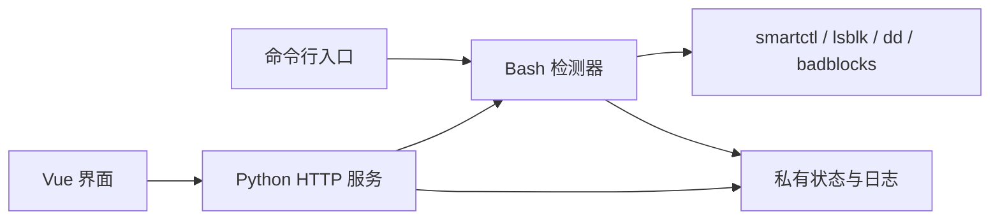

# hdd-health-check — 设计

## 多语言

**简体中文** | [English](en/DESIGN.md) | [Español](es/DESIGN.md)

## 文档

- 项目概览: [README](../README.md)

- 设计思路: [DESIGN](DESIGN.md)

- 项目状态: [LOG](LOG.md)
- 历史记录: [HISTORY](HISTORY.md)
- 变更日志: [CHANGELOG](CHANGELOG.md)

- 第三方声明: [THIRD_PARTY_NOTICES](THIRD_PARTY_NOTICES.md)

## 设计目标

- 以 SMART, 内核日志, 自检和只读读取检查提供磁盘健康证据, 展示启发式评分与历史变化.
- 支持交互式和批处理 CLI, 后台任务, 可续扫盘面检查和本地 Web 控制.
- 提供 SSD/NVMe 适用的完整评估, 排除 HDD 专用速度采样, 保留真实读取错误.
- 明确非目标: 数据恢复, 擦除, 写入测试, 文件系统修复和故障概率预测.

## 架构

检测器负责选盘, 检查与评分. Python 服务管理认证, 调度与固定命令调用, 不重新计算分数. Vue 展示服务端数据, 生产请求同源.

| 顶层位置 | 职责 |
| --- | --- |
| `src/checker/` | 检测器实现; 根目录 Shell 文件为兼容入口 |
| `src/web/` | Python 服务, Vue/TypeScript 前端, npm 清单与锁文件 |
| `lang/web/` | 八种界面语言资源 |
| `deploy/` | Debian 安装器与 systemd 单元 |
| `tests/` | 合成状态, HTTP, 部署定义和浏览器测试 |
| `scripts/` | 项目检查入口 |
| `doc/` | 简体中文源文档, 英文/西语翻译; 图片位于 `resources/<lang>/` |
| `.github/`, `.claude/` | CI 与编辑后设计检查 |
| `.local/` | Git 排除的维护信息与验证记录 |
| `dist/web/` | Git 排除的前端构建产物 |

构建版本来自 Git 标签或 `test-<sha>`, 工作树改动追加 `-dirty`; 无 Git 元数据的源码包标记为测试归档. Vite 把同一标识写入前端与 `version.json`, `/api/build` 返回该标识. 应用变更记录取自独立 `CHANGELOG.md`, 简中使用 `doc/` 根, 英文和西语使用对应语言目录, 其他界面语言回退到英文.

## 设计约束

- 原始设备数据只读; SMART 开关与内部自检可能改变固件状态, 主机会写入日志和记录. 安全停止不取消内部自检.
- 只有同一未过期批次中的快检, 短测, 长测和完整盘面扫描完成, 才有当前综合分数; HDD 还要求速度采样. 旧数据, 中断与复用不能充当新完整批次.
- 慢读和通电时长不能单独证明故障. 原因未明的历史 ATA 错误风险不因计数稳定或接口复查而清除.
- O_DIRECT 不支持或设备不可访问时记录未完成, 不作为介质错误. 读取失败与 badblocks 复查都保留范围和完成状态, 不自动归因于坏道或已修复接口.
- 状态按允许字段解析, 不作为 Shell 代码执行. 设备与模块由服务端枚举和校验, 子进程调用不使用 Shell 插值.
- 安全 API 由服务器强制近期密码验证; IP 访问仅授予普通权限. 密码变更使会话失效. 私有序列号默认遮蔽, 明确请求后才返回原文.
- 保留已发布的 CLI 入口与状态字段. TypeScript 使用与 vue-tsc 已验证兼容的 5.9.3; 7.0.2 与当前 vue-tsc 的组合尚不可用.

## 设计标记

唯一来源为 `src/web/src/styles/tokens.css`, 基础样式位于 `styles/main.css`, 业务布局位于 `style.css`. `components/app/` 提供共享顶栏, 页头, Toast, 标签, 选择控件, 提示, 设置导航与卡片; `components/ui/button/` 提供 shadcn-vue 按钮.

设计标记保留模板的系统字体, 字号, 间距, 圆角, 阴影, 八色明暗调色板和动效. 增加 `--warning` 及状态背景表示风险, `--header-height`, `--login-control-height`, `--password-control-size` 表示认证控件尺寸, `--layer-*` 表示浮层层级, `--tracking-eyebrow` 表示辅助标题, `--app-disk-min-width` 与 `--app-size-*` 表示设备数据和既有业务布局尺寸.

在 `src/web/` 运行 `npm run check`, 依次检查格式, 设计, 类型和生产构建. `.claude/settings.json` 执行同一设计检查, 检查器保留模板原文. 页面立即切换; 非嵌套 `data-reflow` 分组通过 DOM/尺寸观察器更新位置基线, 停止调整 180 ms 后执行 620 ms 过渡. 减少动效或卸载时清理动画和监听. 字面文本宽度决定标签下划线, 信息提示支持焦点与触摸, 末行卡片均分宽度.

## 数据设计

| 位置 | 内容 |
| --- | --- |
| `HDD_STATE_DIR` | 默认 `/var/lib/hdd-health`, 模式 0700; 每盘结果, SMART 历史 CSV, 盘面进度/图, 报告, 维修记录与运行锁 |
| `HDD_LOG_DIR` | 默认 `/var/log/disk-health`; 运行日志可能包含设备标识与主机信息 |
| 状态目录内 `web-*.json` 和 `web-job-history/` | 定时配置, 访问名单, 休眠偏好, 任务收据与归档 |
| 浏览器存储 | `hdd-lang`, `hdd-theme`, `hdd-mode` 保存界面选择; IP 访问记录在拒绝或注销后清除 |

CLI 菜单通过 `settings.conf` 保存以下字段:

| 字段 | 默认值 | 含义 |
| --- | --- | --- |
| `VALID_DAYS` | `7` | 结果有效天数 |
| `RESCAN_POLICY` | `ask` | `ask`, `rescan`, `reuse` 控制旧结果的处理 |
| `PARALLEL` | `1` | 多盘盘面扫描是否并行 |
| `CHUNK_MB` | `64` | 盘面块大小, MiB |
| `SAMPLE_POINTS` | `24` | 速度采样点数 |
| `SAMPLE_MB` | `128` | 每点读取量, MiB |
| `INCLUDE_SSD` | `0` | 菜单是否纳入 SSD/NVMe |
| `AUTO_RECHECK` | `ask` | `ask`, `always`, `never` 控制异常区域复查 |

Web 任务状态使用唯一临时文件原子替换. 密码文件以受限权限保存; 窗口内修改需新密码与确认, 随后会话全部失效. 运行中的状态与日志不会随源码更新删除, 回退需要匹配的数据备份.

## 外部接口

| 接口 | 职责与边界 |
| --- | --- |
| `smartctl` | SMART 查询, 可能启用 SMART 或启动内部自检 |
| `lsblk`, `blockdev`, Linux sysfs 和内核日志 | 枚举, 容量, 链路, 挂载与错误证据 |
| `dd`, `badblocks` | 原始设备只读读取; 不使用写入测试模式 |
| `apt-get` | 经 CLI 确认或 Debian 安装器批准后安装缺少的系统工具 |
| `systemd-run` | 独立后台检查; Web 服务停止不等于检查任务停止 |
| HTTP JSON API | 认证, 数据展示, 调度与固定检查控制; 详见 [Web 指南](WEB.md#api) |

## 扩展

暂无预定义插件机制. 添加检测模块需要同时调整 CLI 调度, 结果字段, 评分覆盖判定, 服务端白名单, 界面语言资源和合成测试.
