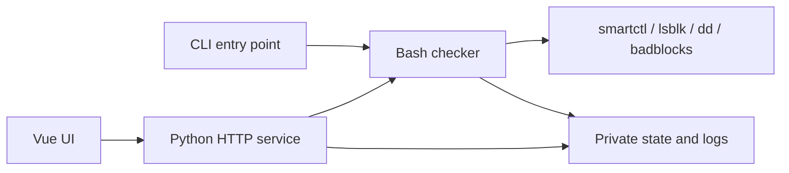

# hdd-health-check — Design

## Multi-language

[简体中文](../DESIGN.md) | **English** | [Español](../es/DESIGN.md)

## Documentation

- Project overview: [README](README.md)

- Design rationale: [DESIGN](DESIGN.md)

- Project status: [LOG](LOG.md)
- Historical records: [HISTORY](HISTORY.md)
- Version changelog: [CHANGELOG](CHANGELOG.md)

- Third-party notices: [THIRD_PARTY_NOTICES](THIRD_PARTY_NOTICES.md)

## Design Goals

- Provide disk health evidence through SMART, kernel logs, self-tests, and read-only reads; display heuristic scoring and historical changes.
- Support interactive and batch CLI, background tasks, resumable surface scans, and a local Web control panel.
- Provide a complete evaluation applicable to SSD/NVMe, excluding HDD-specific speed sampling, while preserving genuine read errors.
- Explicit non-goals: data recovery, erasure, write tests, filesystem repair, and failure probability prediction.

## Architecture

The checker handles disk selection, inspection, and scoring. The Python service manages authentication, scheduling, and fixed command invocations without recalculating scores. Vue displays server-side data; production requests are same-origin.

| Top-level location | Responsibility |
| --- | --- |
| `src/checker/` | Checker implementation; root Shell files serve as compatibility entry points |
| `src/web/` | Python service, Vue/TypeScript frontend, npm manifest and lockfile |
| `lang/web/` | Eight UI language resources |
| `deploy/` | Debian installer and systemd units |
| `tests/` | Synthetic state, HTTP, deploy definitions, and browser tests |
| `scripts/` | Project check entry points |
| `doc/` | Simplified Chinese source docs, English/Spanish translations; images at `resources/<lang>/` |
| `.github/`, `.claude/` | CI and post-edit design checks |
| `.local/` | Git-excluded maintenance info and verification records |
| `dist/web/` | Git-excluded frontend build artifacts |

Build version comes from a Git tag or `test-<sha>`; working-tree changes append `-dirty`; source packages without Git metadata are marked as test archives. Vite writes the same identifier into the frontend and `version.json`; `/api/build` returns that identifier. Application changelog entries are taken from a standalone `CHANGELOG.md`; Simplified Chinese uses the `doc/` root, English and Spanish use their respective language directories, and other UI languages fall back to English.

## Design Constraints

- Raw device data is read-only; SMART enable/disable and internal self-tests may alter firmware state, and the host writes logs and records. A safe stop does not cancel an internal self-test.
- A current composite score exists only when quick, short, long, and full surface scans from the same unexpired batch have completed; HDD additionally requires speed sampling. Stale data, interruptions, and reuse cannot substitute for a new complete batch.
- Slow reads and power-on hours alone cannot prove failure. The risk of historical ATA errors of unknown cause is not cleared by stable counts or interface rechecks.
- When O_DIRECT is unsupported or the device is inaccessible, the result is recorded as incomplete rather than a media error. Both read failures and badblocks rechecks retain scope and completion status, without automatic attribution to bad sectors or a repaired interface.
- State is parsed by allowed fields and never executed as Shell code. Devices and modules are enumerated and validated server-side; subprocess invocations do not use Shell interpolation.
- The security API is enforced by recent server-side password verification; IP access grants only normal privileges. Password changes invalidate all sessions. Private serial numbers are masked by default and returned in plaintext only upon explicit request.
- Published CLI entry points and state fields are preserved. TypeScript uses 5.9.3, verified compatible with vue-tsc; the combination of 7.0.2 with the current vue-tsc is not yet usable.

## Design Tokens

The single source of truth is `src/web/src/styles/tokens.css`, base styles reside in `styles/main.css`, and business layout in `style.css`. `components/app/` provides shared top bar, page header, Toast, tabs, select controls, tooltips, settings navigation, and cards; `components/ui/button/` provides shadcn-vue buttons.

Design tokens preserve the template's system fonts, font sizes, spacing, border radii, shadows, eight-color light/dark palettes, and animations. Additional tokens include `--warning` and status backgrounds indicating risk, `--header-height`, `--login-control-height`, `--password-control-size` for authentication control sizes, `--layer-*` for overlay z-indices, `--tracking-eyebrow` for auxiliary headings, and `--app-disk-min-width` and `--app-size-*` for device data and existing business layout dimensions.

Run `npm run check` in `src/web/` to sequentially check formatting, design, types, and production build. `.claude/settings.json` runs the same design check; the checker preserves template originals. Pages switch immediately; non-nested `data-reflow` groups update position baselines via DOM/size observers and execute a 620 ms transition 180 ms after resizing stops. Animations and listeners are cleaned up on reduced-motion or unmount. Literal text width determines the tab underline, info tooltips support focus and touch, and last-row cards share width equally.

## Data Design

| Location | Contents |
| --- | --- |
| `HDD_STATE_DIR` | Default `/var/lib/hdd-health`, mode 0700; per-disk results, SMART history CSV, surface progress/maps, reports, repair records, and run locks |
| `HDD_LOG_DIR` | Default `/var/log/disk-health`; run logs may contain device identifiers and host info |
| `web-*.json` and `web-job-history/` within the state directory | Schedule config, access list, sleep preferences, job receipts, and archives |
| Browser storage | `hdd-lang`, `hdd-theme`, `hdd-mode` store UI selections; IP access records are cleared after denial or logout |

The CLI menu saves the following fields via `settings.conf`:

| Field | Default | Meaning |
| --- | --- | --- |
| `VALID_DAYS` | `7` | Result validity in days |
| `RESCAN_POLICY` | `ask` | `ask`, `rescan`, `reuse` control handling of stale results |
| `PARALLEL` | `1` | Whether multi-disk surface scans run in parallel |
| `CHUNK_MB` | `64` | Surface block size in MiB |
| `SAMPLE_POINTS` | `24` | Number of speed sampling points |
| `SAMPLE_MB` | `128` | Read volume per point in MiB |
| `INCLUDE_SSD` | `0` | Whether the menu includes SSD/NVMe |
| `AUTO_RECHECK` | `ask` | `ask`, `always`, `never` control anomaly-area rechecks |

Web task state uses unique temporary files with atomic replacement. The password file is stored with restricted permissions; modifications within the window require a new password and confirmation, after which all sessions are invalidated. Running state and logs are not deleted on source updates; rollback requires a matching data backup.

## External Interfaces

| Interface | Responsibility and boundary |
| --- | --- |
| `smartctl` | SMART queries; may enable SMART or start an internal self-test |
| `lsblk`, `blockdev`, Linux sysfs, and kernel logs | Enumeration, capacity, link, mount, and error evidence |
| `dd`, `badblocks` | Raw device read-only reads; write-test mode is not used |
| `apt-get` | Install missing system tools after CLI confirmation or Debian installer approval |
| `systemd-run` | Detached background checks; stopping the Web service does not stop check tasks |
| HTTP JSON API | Authentication, data display, scheduling, and fixed check controls; see [Web guide](WEB.md#api) |

## Extension

No predefined plugin mechanism exists. Adding a check module requires simultaneously adjusting CLI scheduling, result fields, scoring coverage determination, server-side whitelist, UI language resources, and synthetic tests.
