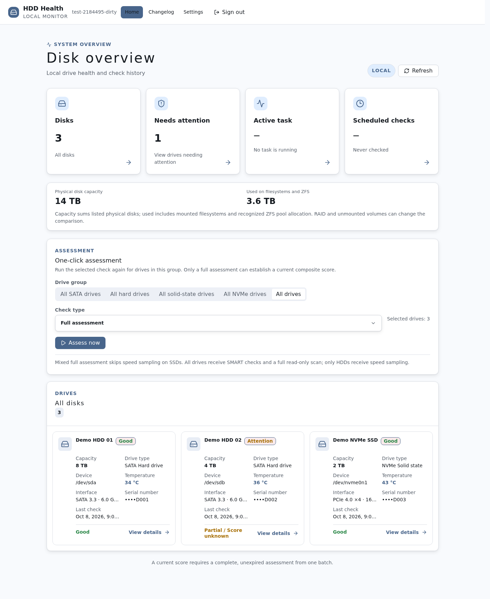
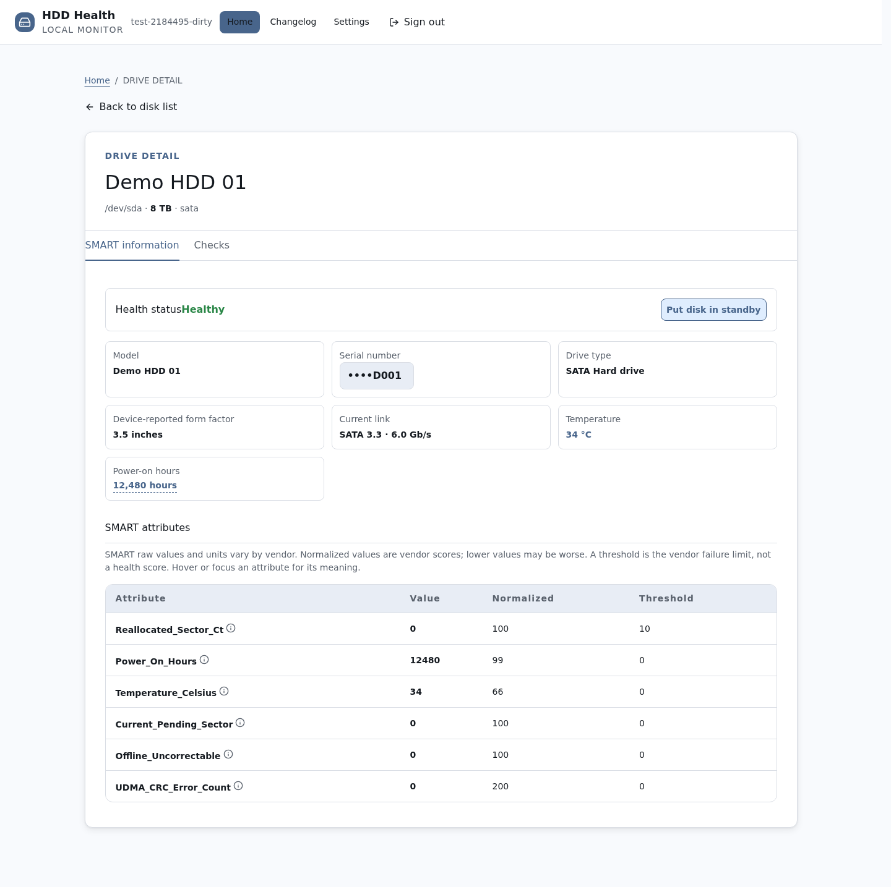
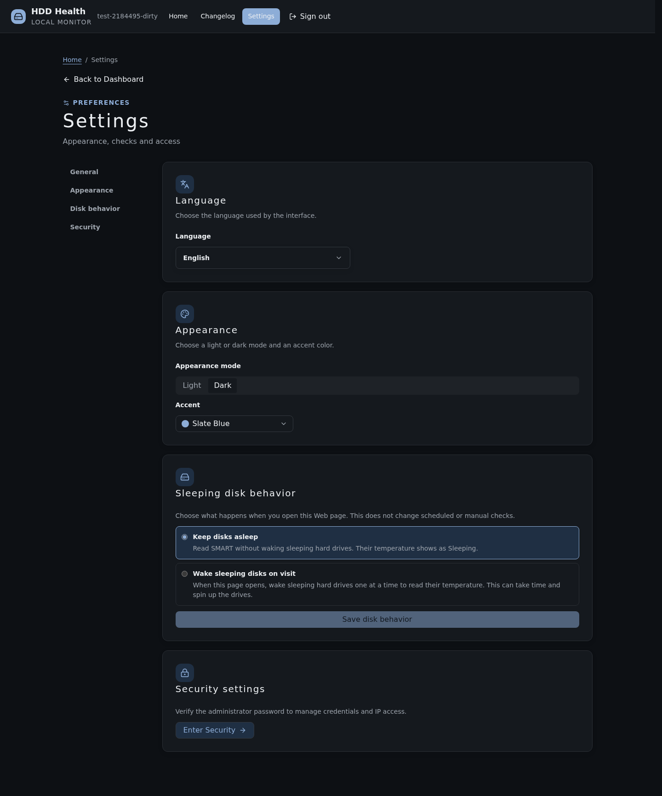
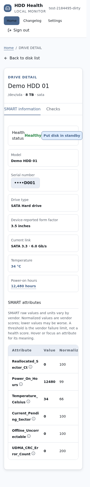

# hdd-health-check


Centralized disk health assessment using SMART and read-only checks, with a command-line interface and a local web controller.

[](../../LICENSE) [](https://github.com/CharlesGool/hdd-health-check/releases/tag/v4.1.0)

## Documentation

- Project overview: [README](README.md)

- Design rationale: [DESIGN](DESIGN.md)

- Project status: [LOG](LOG.md)
- Historical records: [HISTORY](HISTORY.md)
- Version changelog: [CHANGELOG](CHANGELOG.md)

- Third-party notices: [THIRD_PARTY_NOTICES](THIRD_PARTY_NOTICES.md)


## Introduction

hdd-health-check provides a command-line interface and a local web controller that consolidate SMART information, self-test results, read anomalies, and historical changes.

- Quickly check SMART, temperature, mount status, and kernel I/O logs; compare historical error counts.
- Run short tests, long tests, speed sampling, resumable full-disk read-only scans, badblocks re-checks, and post-repair interface verification.
- In the web UI, select disks, view SMART attribute explanations, track background tasks, configure scheduled quick checks, and manage access permissions.
- A full HDD assessment includes quick check, short test, long test, speed sampling, and surface scan; SSD/NVMe devices skip speed sampling. The composite score is shown only when all required checks for the same valid batch are complete. The score is a heuristic indicator, not a failure probability.

**Read-only refers to the target disk data.** The program still writes host logs and state, may enable SMART or trigger disk-internal self-tests; prolonged reads increase device load. Back up data before checking a suspicious disk. The tool does not perform write-pattern bad block tests, erasure, or filesystem repair.

### Interface Showcase

The following screenshots come from the current source built with Chromium, using synthetic demo data, and do not represent real disk measurements or official release packages. Screenshots are provided solely to showcase the interface; [known issues and verification boundaries](LOG.md#bugs) are documented separately.

#### Dashboard

View disk overview, capacity, records requiring attention, and batch-check entry points.



#### SMART Detail

View device attributes and explanations, reveal serial numbers on demand, and switch between detection results within the detail view.



#### Settings

Language, light/dark mode, eight theme colors, and sleep policy are consolidated in general settings; security settings use a separate administrator verification.



#### Mobile View

Disk details and the top bar reflow with the viewport. This screenshot uses a 375 px width and a simulated touch environment.



## Requirements

| Component | Minimum | Recommended or Supplementary |
| --- | --- | --- |
| Detector | Debian/Ubuntu, root, Bash 4.3+, smartmontools, util-linux, coreutils | e2fsprogs provides badblocks; systemd supports background tasks |
| Web service | Python 3.10+, system tools required by the detector | Debian installer requires systemd, default LAN TCP 8765 |
| Frontend build | Node.js 22.12+ or 24+, npm 10+ | npm dependencies use a lock file; production UI does not depend on external CDNs |

Real diagnostics require device and SMART access. Coverage limitations exist for USB/RAID passthrough, SAS/SCSI data, and vendor attributes. The Bash terminal text in this project is primarily in Simplified Chinese; the web UI provides eight languages; core documentation is available in Simplified Chinese, English, and Spanish.

## Install

### Quick Install

Obtain and review trusted source code first, then check the help. This command does not start a scan:

```bash
bash -n hdd-health-check.sh src/checker/hdd-health-check.sh
sudo bash ./hdd-health-check.sh --help
```

### Standard Install

```bash
git clone https://github.com/CharlesGool/hdd-health-check.git
cd hdd-health-check
sudo apt-get update
sudo apt-get install --no-install-recommends smartmontools util-linux coreutils e2fsprogs
sudo bash ./hdd-health-check.sh --help
```

The default checkout is the current `main` source. To use a published version, select the corresponding tag or pre-built package from [GitHub Release](https://github.com/CharlesGool/hdd-health-check/releases/latest); released assets may differ from the current source. Do not pipe unreviewed remote scripts directly into a root shell.

Optional web install:

```bash
cd src/web
npm ci
npm run check
cd ../..
sudo bash deploy/install.sh
```

The installer supports only Debian, installs missing runtime dependencies, deploys to `/root/apps/hdd-health-check`, and enables a password-protected LAN service. The installation itself does not start a manual scan; previously enabled schedule configurations remain active. The login password can be read by an administrator on the host with `sudo cat /root/apps/hdd-health-check/web-password`. Access, rollback, and API details are in the [Web Guide](WEB.md).

## Usage

```bash
sudo bash ./hdd-health-check.sh
sudo bash ./hdd-health-check.sh -d sdb -r quick,short
sudo bash ./hdd-health-check.sh -d sdb -r full --detach
sudo bash ./hdd-health-check.sh --status
sudo bash ./hdd-health-check.sh --stop
```

Device names are examples. Confirm the target device and load before executing scans. `--stop` preserves surface scan progress and does not cancel disk-internal SMART self-tests.

| Option | Meaning |
| --- | --- |
| `-d/--disk`, `-a/--all`, `--include-ssd` | Specify comma-separated devices, select mechanical drives, or include SSD/NVMe |
| `-r/--run` | `quick,short,long,speed,surface,badblocks,iface,full`; default `quick`, a report is generated at the end of a batch |
| `--rescan` | Redo results and surface scans; by default quick checks are redone, other valid results are reused, incomplete surface scans resume |
| `--detach`, `--duration` | Hand off to systemd for background execution; interface stress test minutes, default 15 |
| `--no-install`, `-y/--yes`, `-q/--quiet` | Disable auto-install, auto-confirm prompts, or write logs only; `-y` can also approve dependency installation |
| `-l/--log` | Change the log file location |

Exit codes: `0` good, `1` notice or warning, `2` danger, `3` runtime error. Compatibility flags `-t`, `-s`, `-b` map to existing modules; `-w/--wait` is ignored and does not wait for self-tests to complete.

| Environment Variable | Default or Behavior | Component |
| --- | --- | --- |
| `HDD_STATE_DIR` | `/var/lib/hdd-health`, stores settings, results, history, and progress | Detector and web service |
| `HDD_LOG_DIR` | `/var/log/disk-health`, stores run logs | Detector and web service |
| `NO_COLOR` | When non-empty, disables terminal colors | Detector |
| `HDD_NO_BG` | When non-empty, disables interactive background handoff | Detector |

All environment variables are optional; paths must use trusted absolute paths; refer to `.env.example`. Parameters saved via the menu in `settings.conf` are described in [Data Design](DESIGN.md#data-design).

Development verification:

```bash
bash scripts/check.sh
cd src/web
npm ci
npm run check
node node_modules/playwright/cli.js install chromium
npm run test:ui
npm audit
```

After building, run `node scripts/capture-doc-screenshots.mjs` from the project root to regenerate the introduction screenshots in all three documentation languages, using synthetic devices and isolated state.

These tests use synthetic data and an isolated HTTP service; they do not scan real disks. Documentation link checks are included in `scripts/check.sh`.

## Upgrade

1. Stop or wait for existing checks, back up the state directory and logs that need to be retained. Web updates separately preserve the application, service unit, and password file.
2. Review and update the source; web users rebuild `src/web/`, then run `deploy/install.sh`. The installer preserves existing passwords and state, and saves old application and unit backups.
3. Verify `--help`, web login and build version, device inventory, and history records. The current score requires a new round of complete and valid assessment.

Historical `v3.0.0` used a `web/` source layout; the current layout is `src/web/` and `dist/web/`. Old v2.2 state that does not conform to the current format may be rejected; no v1 CLI or state migration is guaranteed. When rolling back, simultaneously restore the old program and matching state backups; see the [Web Guide](WEB.md#upgrade-and-rollback) for details.

## Uninstall

Quick uninstall preserves data: web users first run `sudo systemctl disable --now hdd-health-web.service`, confirm no independent background checks remain, then remove the installed program or source directory. Deleting the source does not equal deleting the web installation directory.

Full uninstall: after backing up, verify and remove this project's application directory, systemd unit, state directory, and log directory, then run `sudo systemctl daemon-reload`. Do not delete shared directories or directories redirected by environment variables. These operations delete check records; system packages are not automatically uninstalled.

## Acknowledgements

Component versions, upstream sources, and full licenses for Vue, Lucide, Markdown-It, Reka UI, Tailwind CSS, etc. are in [Third-Party Notices](THIRD_PARTY_NOTICES.md).

## License

MIT, SPDX: `MIT`. Full text in [LICENSE](../../LICENSE).
