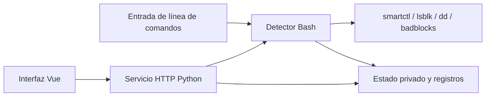

# hdd-health-check — Diseño

## Multilingüe

[简体中文](../DESIGN.md) | [English](../en/DESIGN.md) | **Español**

## Documentación

- Descripción general del proyecto: [README](README.md)

- Justificación del diseño: [DESIGN](DESIGN.md)

- Estado del proyecto: [LOG](LOG.md)
- Registros históricos: [HISTORY](HISTORY.md)
- Historial de cambios: [CHANGELOG](CHANGELOG.md)

- Avisos de terceros: [THIRD_PARTY_NOTICES](THIRD_PARTY_NOTICES.md)

## Objetivos de diseño

- Proporcionar evidencia de salud del disco mediante SMART, registros del kernel, autopruebas y lecturas de solo lectura, mostrando puntuaciones heurísticas y cambios históricos.
- Soportar CLI interactivo y por lotes, tareas en segundo plano, escaneo de superficie resumible y control web local.
- Ofrecer una evaluación completa aplicable a SSD/NVMe, excluyendo el muestreo de velocidad específico de HDD, manteniendo errores de lectura reales.
- Definir explícitamente no objetivos: recuperación de datos, borrado, pruebas de escritura, reparación de sistemas de archivos y predicción de probabilidad de fallo.

## Arquitectura

El detector se encarga de seleccionar discos, realizar comprobaciones y calcular puntuaciones. El servicio Python gestiona autenticación, programación y llamadas a comandos fijos, sin recalcular puntuaciones. Vue muestra datos del servidor; las solicitudes de producción son del mismo origen.

| Ubicación de nivel superior | Responsabilidad |
| --- | --- |
| `src/checker/` | Implementación del detector; los archivos Shell en la raíz son entradas de compatibilidad |
| `src/web/` | Servicio Python, frontend Vue/TypeScript, manifiesto y lockfile de npm |
| `lang/web/` | Recursos de interfaz en ocho idiomas |
| `deploy/` | Instalador Debian y unidades systemd |
| `tests/` | Estado sintético, HTTP, definiciones de despliegue y pruebas de navegador |
| `scripts/` | Punto de entrada de verificaciones del proyecto |
| `doc/` | Documentos fuente en chino simplificado, traducciones al inglés/español; imágenes en `resources/<lang>/` |
| `.github/`, `.claude/` | CI y verificaciones de diseño post-edición |
| `.local/` | Información de mantenimiento y registros de verificación excluidos por Git |
| `dist/web/` | Artefactos de compilación del frontend excluidos por Git |

La versión de compilación proviene de etiquetas Git o `test-<sha>`, los cambios en el árbol de trabajo añaden `-dirty`; los paquetes de código fuente sin metadatos Git se marcan como archivo de prueba. Vite escribe el mismo identificador en el frontend y en `version.json`, `/api/build` devuelve dicho identificador. Los cambios de registro de la aplicación se toman de `CHANGELOG.md` independiente, el chino simplificado usa la raíz de `doc/`, el inglés y el español usan el directorio de idioma correspondiente, otros idiomas de interfaz recurren al inglés.

## Restricciones de diseño

- Los datos de dispositivo en crudo son de solo lectura; los interruptores SMART y las autopruebas internas pueden cambiar el estado del firmware, el host escribe registros y trazas. La parada segura no cancela la autoprueba interna.
- Solo cuando la verificación rápida, la prueba corta, la prueba larga y el escaneo completo de superficie se completan en el mismo lote no expirado existe una puntuación global actual; los HDD además requieren muestreo de velocidad. Datos antiguos, interrupciones y reutilización no pueden actuar como un nuevo lote completo.
- Las lecturas lentas y las horas de encendido no pueden por sí solas demostrar un fallo. El riesgo de errores ATA históricos de causa desconocida no se elimina porque el conteo sea estable o se revisen interfaces.
- Cuando O_DIRECT no está soportado o el dispositivo no es accesible, se registra como incompleto, no como error de medio. Los fallos de lectura y las revisiones con badblocks conservan el rango y el estado de finalización, sin atribuir automáticamente a sectores defectuosos o interfaces ya reparadas.
- El estado se analiza según los campos permitidos, no se ejecuta como código Shell. Los dispositivos y módulos son enumerados y validados por el servidor, las llamadas a subprocesos no usan interpolación de Shell.
- La API segura exige verificación reciente de contraseña impuesta por el servidor; el acceso por IP solo otorga permisos normales. El cambio de contraseña invalida todas las sesiones. Los números de serie privados se enmascaran por defecto, se devuelve el texto original solo tras solicitud explícita.
- Se conservan las entradas CLI publicadas y los campos de estado. TypeScript usa la versión 5.9.3 verificada como compatible con vue-tsc; la combinación 7.0.2 con el vue-tsc actual aún no está disponible.

## Marcas de diseño

La única fuente es `src/web/src/styles/tokens.css`, los estilos base están en `styles/main.css`, el diseño de negocio está en `style.css`. `components/app/` proporciona barra superior compartida, encabezado, Toast, etiquetas, controles de selección, tooltips, navegación de configuración y tarjetas; `components/ui/button/` proporciona botones shadcn-vue.

Las marcas de diseño conservan las fuentes del sistema, tamaños de fuente, espaciado, radios, sombras, paleta de ocho colores claro/oscuro y animaciones de la plantilla. Se añaden `--warning` y fondos de estado para indicar riesgo, `--header-height`, `--login-control-height`, `--password-control-size` para dimensiones de controles de autenticación, `--layer-*` para niveles de superposición, `--tracking-eyebrow` para subtítulos auxiliares, `--app-disk-min-width` y `--app-size-*` para dimensiones de datos de dispositivo y diseño de negocio existente.

En `src/web/` ejecutar `npm run check`, que verifica secuencialmente formato, diseño, tipos y compilación de producción. `.claude/settings.json` ejecuta la misma verificación de diseño, el verificador conserva el texto original de la plantilla. Las páginas cambian inmediatamente; los grupos `data-reflow` no anidados actualizan la línea base de posición mediante observadores DOM/tamaño, ejecutando una transición de 620 ms tras 180 ms sin ajustes. Se limpian animaciones y listeners al reducir movimiento o desmontar. El ancho del texto literal determina el subrayado de etiquetas, los tooltips soportan foco y tacto, las tarjetas de última fila distribuyen el ancho equitativamente.

## Diseño de datos

| Ubicación | Contenido |
| --- | --- |
| `HDD_STATE_DIR` | Por defecto `/var/lib/hdd-health`, modo 0700; resultados por disco, CSV de historial SMART, progreso/gráficos de superficie, informes, registros de reparación y bloqueos de ejecución |
| `HDD_LOG_DIR` | Por defecto `/var/log/disk-health`; los registros de ejecución pueden contener identificadores de dispositivo e información del host |
| `web-*.json` y `web-job-history/` dentro del directorio de estado | Configuración programada, lista de acceso, preferencias de suspensión, recibos de tareas y archivos |
| Almacenamiento del navegador | `hdd-lang`, `hdd-theme`, `hdd-mode` guardan selecciones de interfaz; el registro de acceso por IP se limpia tras rechazo o cierre de sesión |

El menú CLI guarda los siguientes campos mediante `settings.conf`:

| Campo | Valor por defecto | Significado |
| --- | --- | --- |
| `VALID_DAYS` | `7` | Días de validez de los resultados |
| `RESCAN_POLICY` | `ask` | `ask`, `rescan`, `reuse` controlan el tratamiento de resultados antiguos |
| `PARALLEL` | `1` | Si el escaneo de superficie multi-disco es paralelo |
| `CHUNK_MB` | `64` | Tamaño de bloque de superficie, MiB |
| `SAMPLE_POINTS` | `24` | Puntos de muestreo de velocidad |
| `SAMPLE_MB` | `128` | Cantidad de lectura por punto, MiB |
| `INCLUDE_SSD` | `0` | Si el menú incluye SSD/NVMe |
| `AUTO_RECHECK` | `ask` | `ask`, `always`, `never` controlan la revisión de zonas anómalas |

El estado de tareas Web usa reemplazo atómico mediante archivo temporal único. El archivo de contraseña se guarda con permisos restringidos; la modificación dentro de la ventana requiere nueva contraseña y confirmación, tras lo cual todas las sesiones se invalidan. Los estados y registros en ejecución no se eliminan con actualizaciones del código fuente, el retroceso requiere respaldos de datos coincidentes.

## Interfaces externas

| Interfaz | Responsabilidad y límites |
| --- | --- |
| `smartctl` | Consultas SMART, puede habilitar SMART o iniciar autopruebas internas |
| `lsblk`, `blockdev`, sysfs de Linux y registros del kernel | Enumeración, capacidad, enlace, montaje y evidencia de errores |
| `dd`, `badblocks` | Lectura de solo lectura de dispositivo en crudo; no se usa modo de prueba de escritura |
| `apt-get` | Instala herramientas del sistema faltantes tras confirmación por CLI o aprobación del instalador Debian |
| `systemd-run` | Comprobación en segundo plano independiente; detener el servicio Web no detiene las tareas de comprobación |
| API JSON HTTP | Autenticación, presentación de datos, programación y control de comprobaciones fijas; ver [Guía Web](WEB.md#api) |

## Extensión

No existe un mecanismo de plugins predefinido. Añadir módulos de detección requiere ajustar simultáneamente la programación CLI, campos de resultados, determinación de cobertura de puntuación, lista blanca del servidor, recursos de idiomas de interfaz y pruebas sintéticas.
