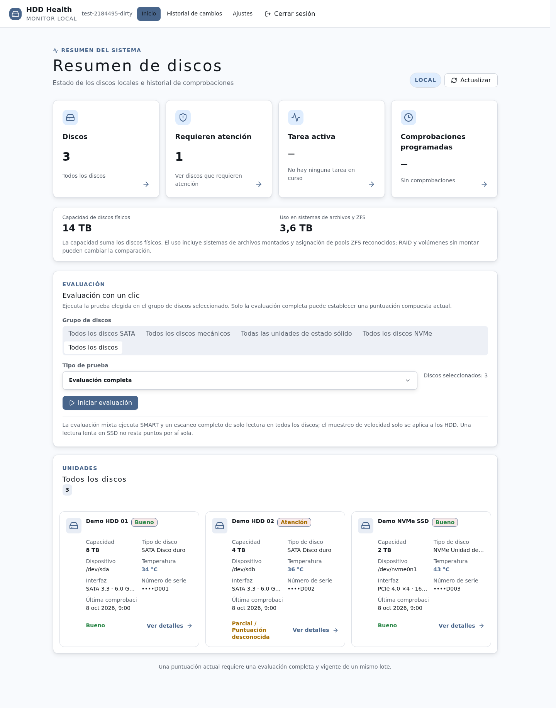
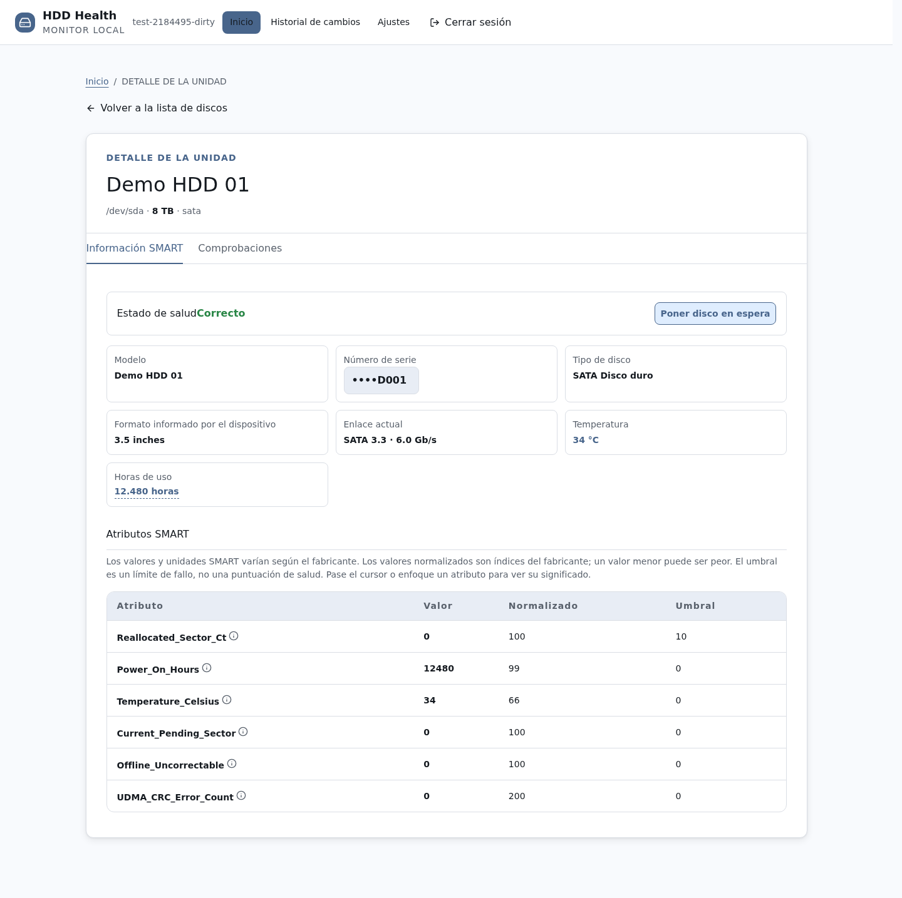
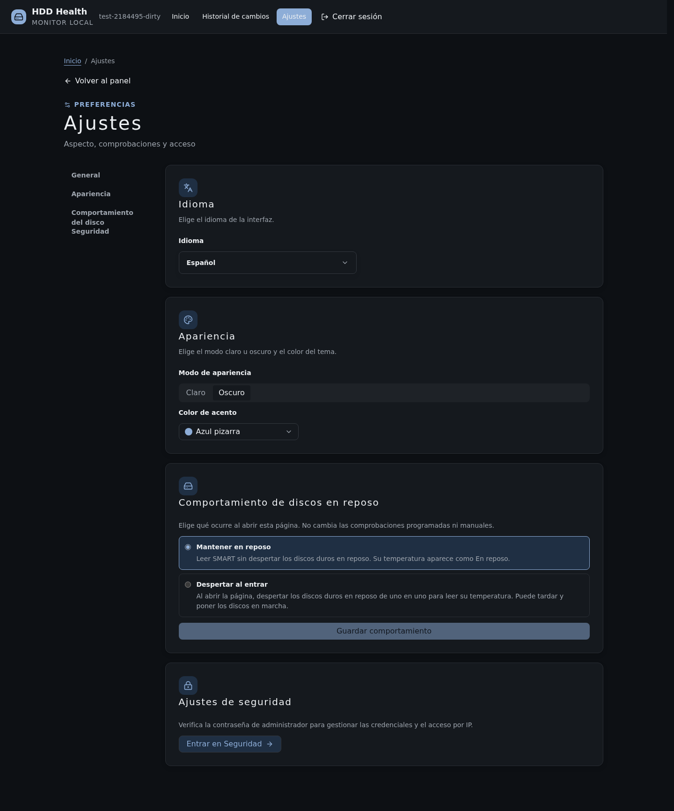
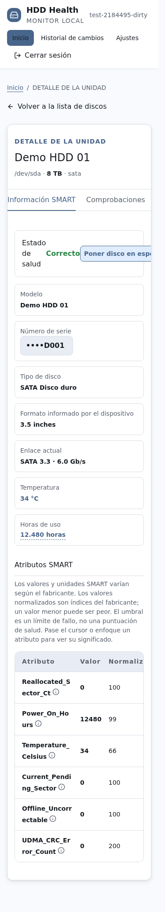

# hdd-health-check


[简体中文](../../README.md) | [English](../en/README.md) | **Español**

Evaluación centralizada de la salud de discos mediante SMART y verificaciones de solo lectura, con controlador de línea de comandos y controlador web local.

[](../../LICENSE) [](https://github.com/CharlesGool/hdd-health-check/releases/tag/v4.1.0)

## Documentación

- Descripción general del proyecto: [README](README.md)

- Justificación del diseño: [DESIGN](DESIGN.md)

- Estado del proyecto: [LOG](LOG.md)
- Registros históricos: [HISTORY](HISTORY.md)
- Historial de cambios: [CHANGELOG](CHANGELOG.md)

- Avisos de terceros: [THIRD_PARTY_NOTICES](THIRD_PARTY_NOTICES.md)


## Introducción

hdd-health-check ofrece un controlador de línea de comandos y un controlador web local que centraliza la información SMART, los resultados de autoverificación, las anomalías de lectura y los cambios históricos.

- Verificación rápida de SMART, temperatura, estado de montaje y registros de E/S del kernel; comparación de contadores de errores históricos.
- Ejecución de prueba corta, prueba larga, muestreo de velocidad, escaneo completo de solo lectura reanudable, reverificación con badblocks y verificación de interfaz tras reparación.
- En la interfaz web, seleccionar discos, ver explicaciones de atributos SMART, seguir tareas en segundo plano, programar verificaciones rápidas y gestionar permisos de acceso.
- La evaluación completa de un HDD incluye verificación rápida, prueba corta, prueba larga, muestreo de velocidad y escaneo de superficie; los SSD/NVMe no se someten a muestreo de velocidad. Solo cuando se completan todas las verificaciones obligatorias del mismo lote válido se muestra la puntuación compuesta actual. La puntuación es una métrica heurística, no una probabilidad de fallo.

**Solo lectura se refiere a los datos del disco de destino.** El programa sigue escribiendo en los registros y el estado del host, puede habilitar SMART o iniciar la autoverificación interna del disco; la lectura prolongada aumenta la carga del dispositivo. Realice una copia de seguridad antes de verificar un disco sospechoso. La herramienta no ejecuta pruebas de bloques defectuosos en modo escritura, borrado ni reparación del sistema de archivos.

### Presentación de la interfaz

Las siguientes capturas provienen de una compilación Chromium del código fuente actual, utilizan datos de demostración sintéticos y no representan mediciones reales de discos ni paquetes de versión oficiales. Las capturas solo sirven para mostrar la interfaz; los [problemas conocidos y límites de verificación](LOG.md#errores) se registran por separado.

#### Panel de control

Vista general de discos, capacidad, registros que requieren atención y acceso a verificaciones por lotes.



#### Detalle SMART

Atributos del dispositivo con explicaciones, visualización opcional del número de serie y cambio entre resultados de detección dentro del detalle.



#### Configuración

Idioma, modo claro/oscuro, ocho colores de tema y política de suspensión se agrupan en la configuración general; la configuración de seguridad utiliza verificación de administrador independiente.



#### Vista móvil

Los detalles del disco y la barra superior se reorganizan según el viewport. Esta captura usa un ancho de 375 px y un entorno táctil simulado.



## Requisitos

| Componente | Requisito mínimo | Recomendado o complementario |
| --- | --- | --- |
| Detector | Debian/Ubuntu, root, Bash 4.3+, smartmontools, util-linux, coreutils | e2fsprogs proporciona badblocks; systemd permite tareas en segundo plano |
| Servicio web | Python 3.10+, herramientas del sistema necesarias para el detector | El instalador de Debian requiere systemd, TCP 8765 en LAN por defecto |
| Compilación del frontend | Node.js 22.12+ o 24+, npm 10+ | Las dependencias de npm usan archivo de bloqueo; la UI de producción no depende de CDN externos |

El diagnóstico real requiere acceso al dispositivo y a SMART. Existen limitaciones en la cobertura de reenvío USB/RAID, datos SAS/SCSI y atributos del fabricante. El texto de terminal en Bash del proyecto está principalmente en chino simplificado; la interfaz web ofrece ocho idiomas; la documentación principal está disponible en chino simplificado, inglés y español.

## Instalación

### Instalación rápida

Obtenga y revise el código fuente de confianza, verifique la ayuda. Este comando no inicia ningún escaneo:

```bash
bash -n hdd-health-check.sh src/checker/hdd-health-check.sh
sudo bash ./hdd-health-check.sh --help
```

### Instalación estándar

```bash
git clone https://github.com/CharlesGool/hdd-health-check.git
cd hdd-health-check
sudo apt-get update
sudo apt-get install --no-install-recommends smartmontools util-linux coreutils e2fsprogs
sudo bash ./hdd-health-check.sh --help
```

La rama `main` contiene el código fuente actual. Para usar una versión publicada, seleccione la etiqueta o el paquete precompilado correspondiente desde [GitHub Release](https://github.com/CharlesGool/hdd-health-check/releases/latest); los activos publicados pueden diferir del código fuente actual. No canalice scripts remotos sin revisar directamente a una shell root.

Instalación web opcional:

```bash
cd src/web
npm ci
npm run check
cd ../..
sudo bash deploy/install.sh
```

El instalador solo admite Debian, instala las dependencias de ejecución faltantes, despliega en `/root/apps/hdd-health-check`, habilita un servicio protegido con contraseña accesible en LAN. La instalación no inicia un escaneo manual; la configuración programada ya habilitada sigue activa. La contraseña de inicio de sesión puede leerse en el host con `sudo cat /root/apps/hdd-health-check/web-password`. Para acceso, reversión y descripción de la API, consulte la [Guía web](WEB.md).

## Uso

```bash
sudo bash ./hdd-health-check.sh
sudo bash ./hdd-health-check.sh -d sdb -r quick,short
sudo bash ./hdd-health-check.sh -d sdb -r full --detach
sudo bash ./hdd-health-check.sh --status
sudo bash ./hdd-health-check.sh --stop
```

Los nombres de dispositivo son ejemplos. Confirme el dispositivo de destino y la carga antes de ejecutar escaneos. `--stop` conserva el progreso del escaneo de superficie y no cancela la autoverificación SMART interna del disco.

| Opción | Significado |
| --- | --- |
| `-d/--disk`, `-a/--all`, `--include-ssd` | Especificar dispositivos separados por comas, seleccionar discos mecánicos o incluir SSD/NVMe |
| `-r/--run` | `quick,short,long,speed,surface,badblocks,iface,full`; por defecto `quick`, genera un informe al final del lote |
| `--rescan` | Rehacer resultados y escaneo de superficie; por defecto rehace la verificación rápida, reutiliza otros resultados válidos, reanuda escaneos de superficie incompletos |
| `--detach`, `--duration` | Delegar a systemd en segundo plano; minutos de prueba de presión de interfaz, por defecto 15 |
| `--no-install`, `-y/--yes`, `-q/--quiet` | Prohibir instalación automática, confirmar prompts automáticamente o escribir solo en el registro; `-y` también aprueba la instalación de dependencias |
| `-l/--log` | Cambiar la ubicación del archivo de registro |

Los códigos de salida son `0` bueno, `1` advertencia o precaución, `2` peligro, `3` error de ejecución. Los parámetros de compatibilidad `-t`, `-s`, `-b` corresponden a módulos existentes; `-w/--wait` se ignora, no espera a que finalice la autoverificación.

| Variable de entorno | Valor por defecto o comportamiento | Componente |
| --- | --- | --- |
| `HDD_STATE_DIR` | `/var/lib/hdd-health`, almacena configuración, resultados, historial y progreso | Detector y servicio web |
| `HDD_LOG_DIR` | `/var/log/disk-health`, almacena registros de ejecución | Detector y servicio web |
| `NO_COLOR` | Desactiva el color en terminal si no está vacío | Detector |
| `HDD_NO_BG` | Desactiva la entrega interactiva en segundo plano si no está vacío | Detector |

Las variables de entorno son opcionales, las rutas deben ser absolutas y de confianza; consulte `.env.example`. Los parámetros guardados desde el menú en `settings.conf` se describen en [Diseño de datos](DESIGN.md#diseño-de-datos).

Verificación de desarrollo:

```bash
bash scripts/check.sh
cd src/web
npm ci
npm run check
node node_modules/playwright/cli.js install chromium
npm run test:ui
npm audit
```

Estas pruebas usan datos sintéticos y un servicio HTTP aislado, no escanean discos reales. La verificación de enlaces de documentación está incluida en `scripts/check.sh`.

Después de compilar, ejecute `node scripts/capture-doc-screenshots.mjs` desde la raíz para regenerar las capturas de introducción en los tres idiomas, utilizando dispositivos sintéticos y estado aislado.

## Actualización

1. Detenga o espere a que finalicen las verificaciones en curso, haga copia de seguridad del directorio de estado y los registros que desee conservar. Las actualizaciones web conservan por separado la aplicación, la unidad de servicio y el archivo de contraseña.
2. Revise y actualice el código fuente; los usuarios de web reconstruyan `src/web/` y luego ejecuten `deploy/install.sh`. El instalador conserva la contraseña y el estado existentes, y guarda copias de la aplicación antigua y de la unidad.
3. Verifique `--help`, el inicio de sesión web y la versión de compilación, el inventario de dispositivos y el historial. La puntuación actual requiere una nueva evaluación completa y válida.

La versión histórica `v3.0.0` usaba la estructura `web/`, la actual usa `src/web/` y `dist/web/`. El estado antiguo de v2.2 que no cumple el formato actual puede ser rechazado; no se garantiza la migración de CLI o estado desde v1. Para revertir, restaure simultáneamente el programa antiguo y la copia de estado coincidente; consulte la [Guía web](WEB.md#actualización-y-reversión).

## Desinstalación

La desinstalación rápida conserva los datos: los usuarios de web ejecuten primero `sudo systemctl disable --now hdd-health-web.service`, confirmen que no hay verificaciones en segundo plano independientes y luego eliminen el programa instalado o el directorio de código fuente. Eliminar el código fuente no equivale a eliminar el directorio de instalación web.

Desinstalación completa: tras la copia de seguridad, verifique y elimine el directorio de aplicación de este proyecto, la unidad systemd, el directorio de estado y el directorio de registros, luego ejecute `sudo systemctl daemon-reload`. No elimine directorios compartidos o redirigidos por variables de entorno. Estas operaciones eliminan los registros de verificación; los paquetes del sistema no se desinstalan automáticamente.

## Agradecimientos

Las versiones, fuentes upstream y licencias completas de componentes como Vue, Lucide, Markdown-It, Reka UI y Tailwind CSS se encuentran en [Declaraciones de terceros](THIRD_PARTY_NOTICES.md).

## Licencia

MIT, SPDX: `MIT`. Texto completo en [LICENSE](../../LICENSE).
